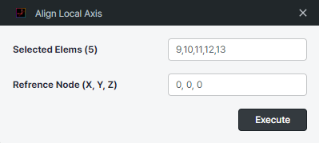

**Intro**
---------

판 요소의 Local z 축을 Reference Point 로 정렬합니다.

원통형 구조물의 local 축을 정렬 할 때 유용하게 활용 할 수 있습니다.

* plate 요소 local 축 정렬

**Version**
-----------

v 1.0.0 : 플러그인 배포

**Language**
------------

영어

**Benefits of this plugin**
---------------------------

원통형 구조물과 같이 구조물의 local 축을 하나의 Point로 정렬하고 싶을 경우, 해당 기능을 이용하여 정렬 할 수 있습니다.

**How to use this plugin?**
---------------------------

1.  **Select Elements**  
    midas Civil 에서 요소를 선택 후, plug in 을 클릭하면 해당 요소들이 입력됩니다.
    
2.  **Reference Point**  
    local z 축이 정렬 될 절점 좌표를 입력합니다. 해당 절점을 대상으로 local z 축이 정렬되며, local 축에 따라 정렬이 되지 않을 수 있습니다. 
    

**Note**
--------

Plate 요소의 local 축을 정렬하는 로직은 아래와 같습니다.

* Plate 요소의 생성 direction에 따라 평면의 법선 벡터를 계산합니다.

* 평면의 중심에서 기준점(Reference Point) 까지의 벡터를 계산합니다.

* 만약 벡터 사이의 각도가 90도 이하라면 local 축 정렬을 하지 않으며, 90 이상일 경우 plate 요소의 방향을 반전시켜 반대 축으로 정렬합니다.

**Model File**
--------------

https://github.com/midasit-dev/plugins/tree/main/projects/align-local-axis-for-element/model

