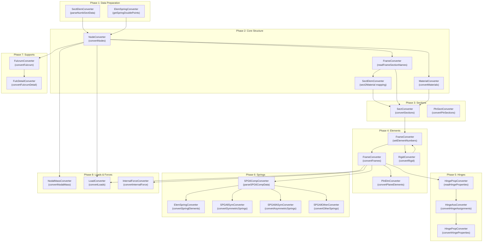
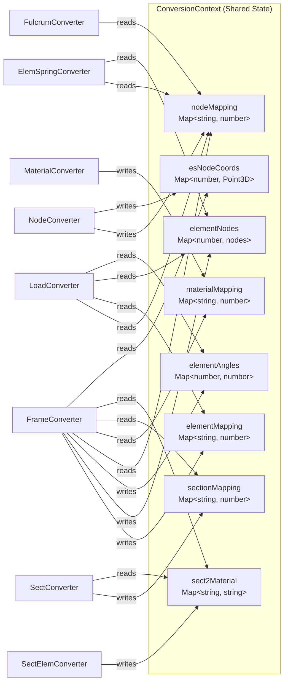
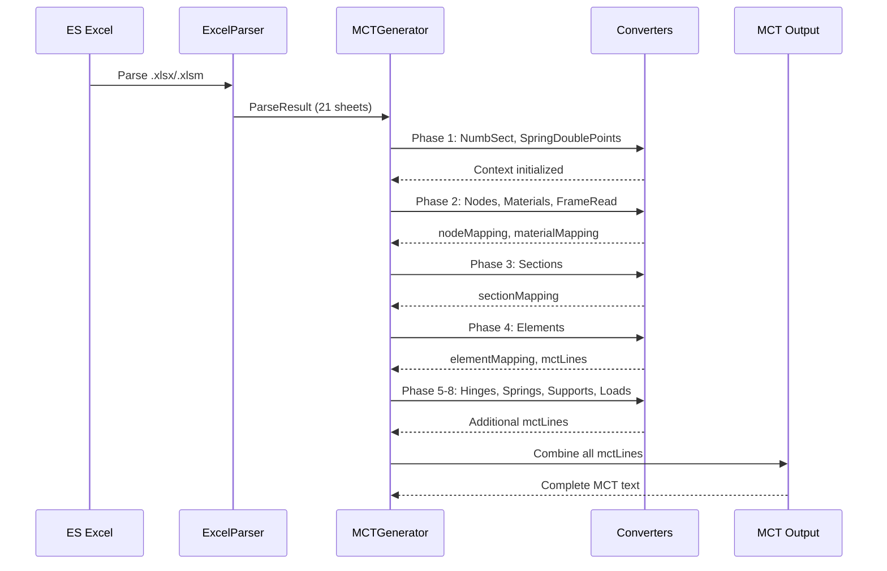

# ES Convertor - Converter Dependencies

## Overview

This document shows the dependency structure between converters in the ES Convertor project.
The converters transform ES (Engineer Studio) Excel data to MIDAS Civil NX MCT format.

## Execution Flow Diagram

## Context Dependencies

The converters share data through a `ConversionContext` object:

## Converter-to-VBA Class Mapping

| TypeScript Converter | VBA Class | Sheet Name |
|---------------------|-----------|------------|
| NodeConverter | Class010_Node | 節点座標 |
| FrameConverter | Class020_Frame | フレーム要素 |
| PlnElmConverter | Class030_PlnElm | 平板要素 |
| RigidConverter | Class040_Rigid | 剛体要素 |
| MaterialConverter | Class050_Material | 材料 |
| SectElemConverter | Class055_NumbSect + Class060_SectElem | 数値断面, 断面要素 |
| SectConverter | Class070_Sect | 断面特性ｵﾌﾟｼｮﾝ |
| PlnSectConverter | Class080_PlnSect | 平板断面 |
| HingePropConverter | Class090_Hinge_Prop | M-φ要素詳細 |
| HingeAssConverter | Class100_Hinge_Ass | M-φ特性表 |
| ElemSpringConverter | Class110_ElemSpring | ばね要素 |
| SPG6CompConverter | Class120_SPG6Comp | ばね特性表_6成分概要 |
| SPGAllSymConverter | Class130_SPGAllSym | ばね特性表_成分一覧(対称) |
| SPGAllASymConverter | Class140_SPGAllASym | ばね特性表_成分一覧(非対称) |
| SPGAllOtherConverter | Class150_SPGAllOther | ばね特性表_成分一覧(その他) |
| FulcrumConverter | Class160_Fulcrum | 支点 |
| FulcDetailConverter | Class170_FulcDetail | 支点詳細 |
| NodalMassConverter | Class180_NodalMass | 節点質量 |
| LoadConverter | Class190_Load | 荷重値 |
| InternalForceConverter | Class200_InternalForce | 内力 |

## Data Flow Summary

