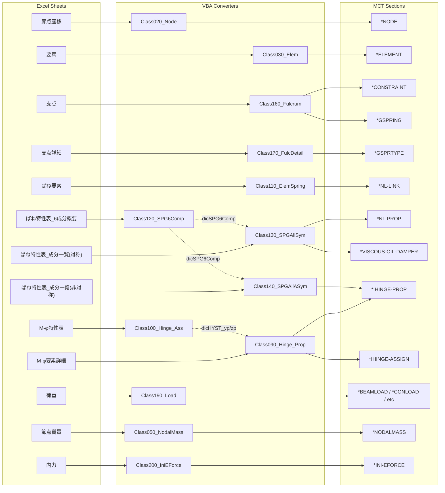
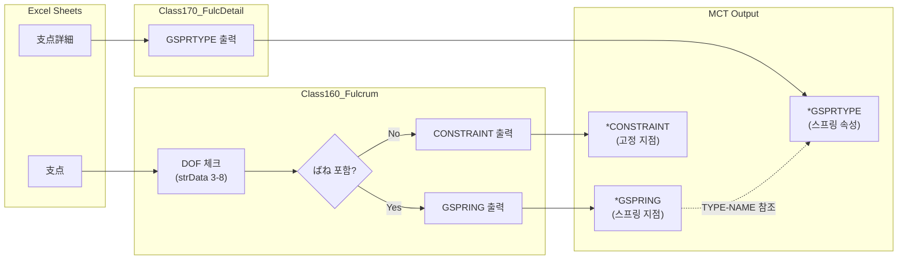
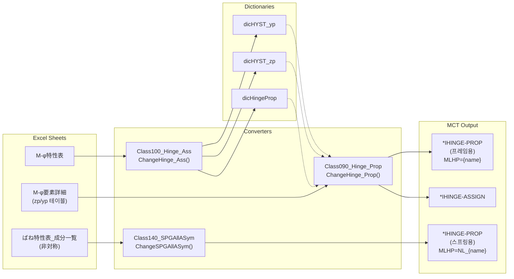
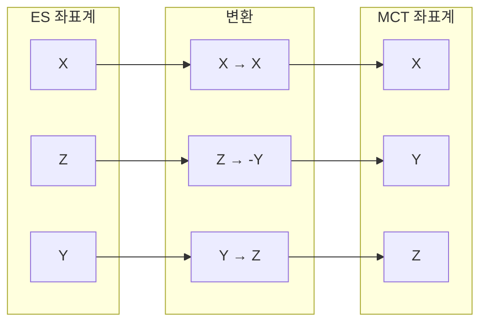
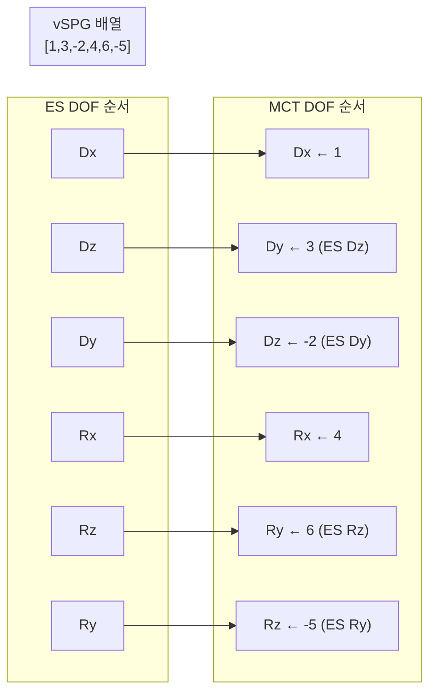
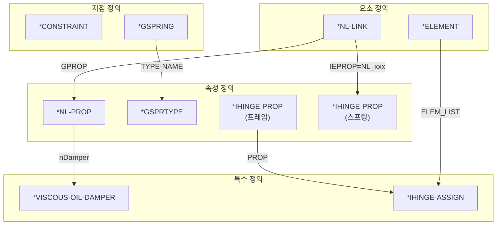

# ES Convertor JP - 변환 흐름도

## 전체 변환 흐름 (Mermaid)



---

## 스프링 관련 상세 흐름

```mermaid
flowchart LR
    subgraph SHEETS["Excel Sheets"]
        S1["ばね要素"]
        S2["ばね特性表_6成分概要"]
        S3["ばね特性表_成分一覧(対称)"]
        S4["ばね特性表_成分一覧(非対称)"]
    end

    subgraph CONVERTERS["Converters"]
        C1["Class110_ElemSpring<br/>ChangeElemSpring()"]
        C2["Class120_SPG6Comp<br/>GetHingeSPG6Comp()"]
        C3["Class130_SPGAllSym<br/>ChangeSPGAllSym()"]
        C4["Class140_SPGAllASym<br/>ChangeSPGAllASym()"]
    end

    subgraph MCT["MCT Output"]
        M1["*NL-LINK<br/>(요소 정의)"]
        M2["*NL-PROP<br/>(속성 정의)"]
        M3["*VISCOUS-OIL-DAMPER<br/>(댐퍼 정의)"]
        M4["*IHINGE-PROP<br/>(비대칭 힌지)"]
    end

    S1 --> C1 --> M1
    S2 --> C2
    C2 -.->|dicSPG6Comp<br/>이력유형 판별| C3
    C2 -.->|dicSPG6Comp| C4
    S3 --> C3
    C3 --> M2
    C3 -->|BMR(CD)ダンパー| M3
    S4 --> C4 --> M4

    M1 -.->|GPROP 참조| M2
    M2 -.->|nDamper 참조| M3
    M1 -.->|IEPROP=NL_xxx| M4
```

---

## 지점(Support) 관련 상세 흐름



---

## 힌지(Hinge) 관련 상세 흐름



---

## 좌표 변환 흐름





---

## 전체 시트-MCT 매핑 테이블

| Excel Sheet                      | VBA Class              | MCT Section(s)                    |
| -------------------------------- | ---------------------- | --------------------------------- |
| 節点座標                         | Class020_Node          | \*NODE                            |
| 要素                             | Class030_Elem          | \*ELEMENT                         |
| 支点                             | Class160_Fulcrum       | \*CONSTRAINT, \*GSPRING           |
| 支点詳細                         | Class170_FulcDetail    | \*GSPRTYPE                        |
| ばね要素                         | Class110_ElemSpring    | \*NL-LINK                         |
| ばね特性表\_6成分概要            | Class120_SPG6Comp      | (dicSPG6Comp 생성)                |
| ばね特性表\_成分一覧(対称)       | Class130_SPGAllSym     | \*NL-PROP, \*VISCOUS-OIL-DAMPER   |
| ばね特性表\_成分一覧(非対称)     | Class140_SPGAllASym    | \*IHINGE-PROP                     |
| M-φ特性表                        | Class100_Hinge_Ass     | (dicHYST 생성), \*IHINGE-ASSIGN   |
| M-φ要素詳細                      | Class090_Hinge_Prop    | \*IHINGE-PROP, \*IHINGE-ASSIGN    |
| 荷重                             | Class190_Load          | \*BEAMLOAD, \*CONLOAD, etc        |
| 節点質量                         | Class050_NodalMass     | \*NODALMASS                       |
| 内力                             | Class200_IniEForce     | \*INI-EFORCE                      |

---

## MCT 섹션 간 참조 관계


