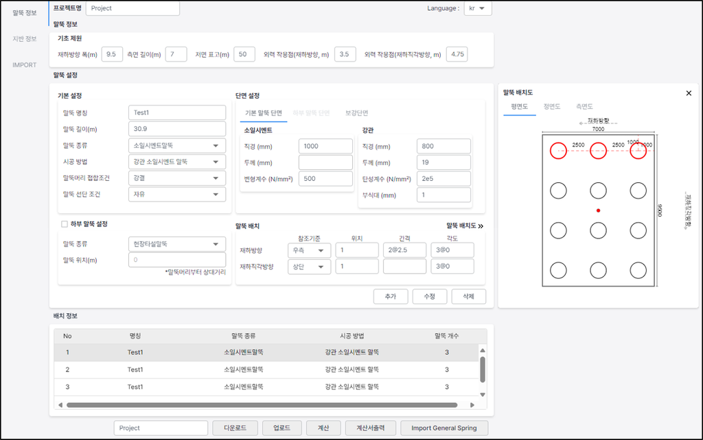
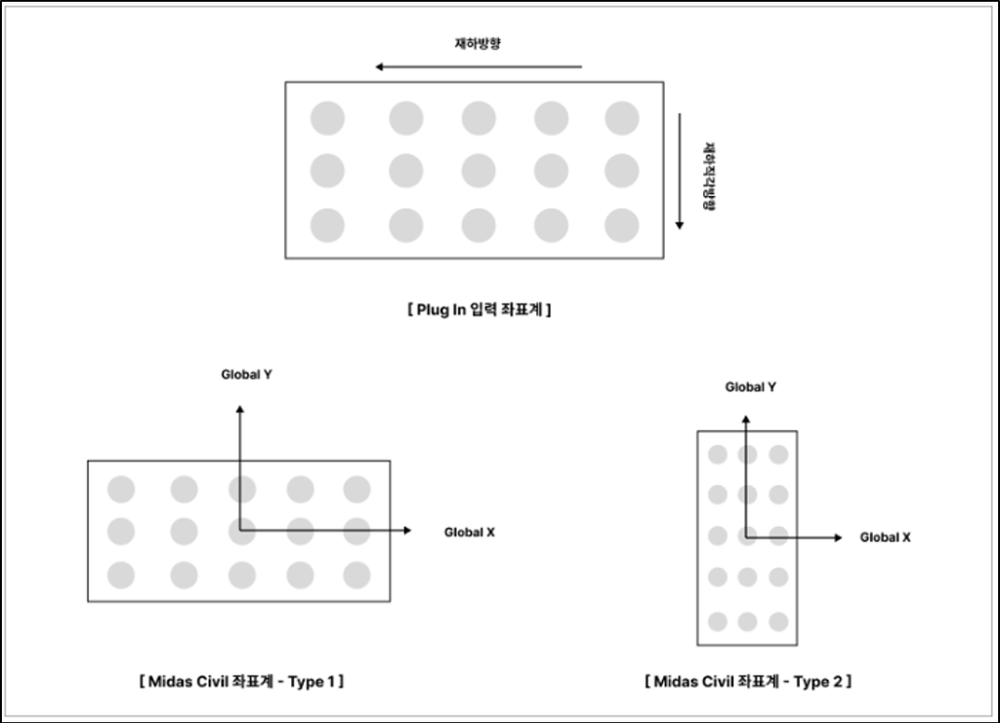
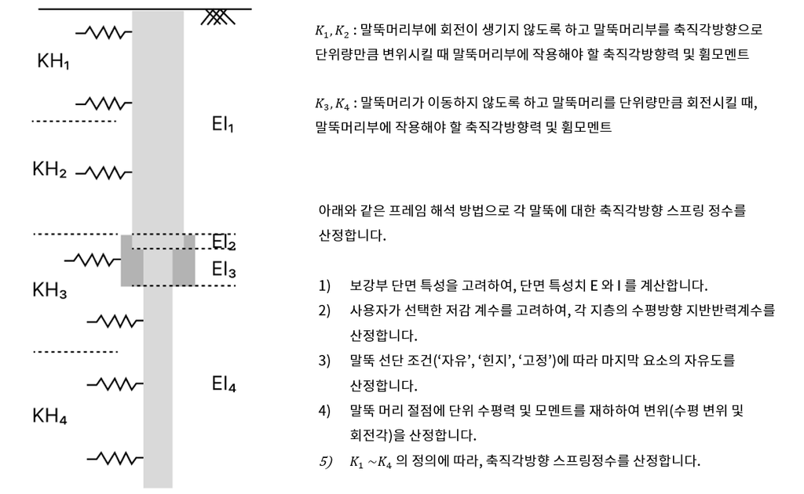

**Intro**
---------

말뚝 기초를 모델링하는 방법 중, 6x6 General Spring 으로 말뚝 기초 강성을 고려할 수 있도록 합니다.

도로교 설계기준 2010 의 변위법을 이용한 말뚝 기초 강성 계산을 지원합니다.

말뚝 기초의 제원 (말뚝 타입, 상,하부 말뚝, 보강)을 입력 한 뒤 말뚝을 배치하며, 지반 정보를 입력합니다.

각 말뚝의 특성치 및 축방향 스프링정수(Kv), 축직각방향 강성(K1 ~ K4) 를 확인 할 수 있으며 방향 별(Global X, Y) 연성 스프링 매트릭스 값을 엑셀 계산서로 확인 할 수 있습니다.

최종적으로, 방향 별 매트릭스를 조합한 6x6 General Spring 을 계산하여 midas Civil 의 General Spring 으로 import 합니다.

*   말뚝 제원 및 지반 정보 입력으로 변위법을 이용한 6x6 강성 매트릭스 계산
    
*   상시, 지진시, 고유주기 산정시의 매트릭스 지원
    
*   “현장타설말뚝”, “PHC 말뚝”, “SC말뚝”, “강관 말뚝”, “소일시멘트 말뚝” 타입 지원
    
*   복합 말뚝(상,하부 말뚝) 및 무리 말뚝, 단일 말뚝 지원
    

**Version**
-----------

v 1.0.0 : 플러그인 배포

**Language**
------------

한국어, 일본어

**Benefits of this plugin**
---------------------------

말뚝 기초를 모델링하는 방법은 크게, 고정점 모델, 가상 고정점(beta) 모델, p-y curve 모델, 6x6 general spring 모델이 있습니다.

본 플러그인은 6x6 general spring 을 이용한 모델링 시 강성 매트릭스를 계산하여 midas civil의 general spring 을 자동 생성해줍니다.

기존의 엑셀 계산서에서 말뚝 특성치, 축방향 및 축직각방향 스프링 강성, 최종적으로 매트릭스 조합하는 방법을 플러그인 내에서 자동으로 수행해줍니다.

계산 값은 엑셀 계산서로서 확인이 가능합니다.

**How to use this plugin?**
---------------------------

매트릭스를 계산하기 위해서, “말뚝 정보”에서 말뚝 제원과 관련된 입력을 실시하며 “지반 정보”에서 지반 정수들을 입력합니다.

### **말뚝 정보**

 
[말뚝 정보 입력 탭]

 

말뚝 정보 탭에서는 말뚝의 제원과 관련된 입력값과 배치를 진행합니다.  
  
단일말뚝, 무리말뚝, 보강 단면, 상하부 복합 말뚝 등을 지원하며, 지원 타입은 아래와 같습니다.  
  
_말뚝 종류 : 현장타설말뚝, PHC 말뚝, SC 말뚝, 강관말뚝, 소일시멘트 말뚝_  
_시공 방법 : 타격말뚝(타격 공법), 타격 말뚝(바이브러 해머 공법), 현장타설말뚝, 중굴착말뚝, preboring 말뚝, 강관 소일시멘트 말뚝, 회전말뚝_  
  
\* 단면 입력값에 따른 단면 특성치 계산은 첨부 메뉴얼의 Appendix 참고  
  
말뚝 배치의 경우 ‘도로교 설계기준 2010’에서의 좌표계를 따르며, midas civil 로 import 시 civil 좌표계로 변환하여 입력됩니다.

### 지반 정보

 
[지반 정보 입력 탭]

 

지반 정보 탭에서는 지반 물성치와 관련된 정수와, 수평지반반력계수의 저감 계수 등을 선택합니다.

층 선택(점성토, 사질토, 사력토) 및 도로 설계 편람에 따른 전단파 속도 자동 계산을 지원합니다.

또한 수평지반반력계수(KH)의 액상화 층에 대한 저감, 사면 효과에 대한 저감, 군말뚝 효과에 의한 저감을 고려할 수 있는 옵션을 제공합니다.

### **Import**

 
[Import 탭]

 

강성 매트릭스 결과를 확인 한 뒤, midas Civil 로 6x6 general spring 을 입력합니다.

Type1 과 Type 는 Plug In 의 재하 좌표계와 midas Civil 좌표계를 맞추기 위한 설정값입니다.

### **말뚝 특성치 계산 흐름도**

본 플러그인을 통해 말뚝 특성치를 계산 할 수 있습니다. 6x6 General Spring 으로 모델링하지 않고, 가상 고정점 모델을 적용하는 경우 엑셀 계산서에 출력된 말뚝 특성치(beta) 를 이용해 가상 고정점 위치를 산정 할 수 있습니다.

엑셀 계산서로 복합 말뚝의 특성치를 계산할 경우, 일반적으로 상부 말뚝의 단면 특성치(EI) 와 단일 지반반력계수(KH) 값으로 특성치를 산정합니다.

본 플러그인의 경우 상,하부 말뚝의 제원뿐만 아니라 보강 단면(피복 및 충진 단면)까지 고려하며, 다층 지반의 지반반력계수를 고려하여 말뚝의 특성치를 계산합니다.

말뚝 특성치 계산 방법은 아래와 같습니다.

 
[말뚝 특성치 계산 방법]

 

### **축방향 스프링정수(Kv) 계산 방법**

축방향 스프링 정수는 도로교설계기준 2010에 제시된 수식으로 산정합니다.

노출 말뚝의 경우 보정 계수를 적용하지 않으며, 일반적으로 실무에 적용하는 복합 말뚝 (SC + PHC) 의 경우 PHC 말뚝의 단면 제원만을 고려하여 산정합니다.

혼합 말뚝의 경우 직렬 스프링 강성식으로 축방향 스프링정수를 산정합니다.

 
[축방향 스프링정수 계산 방법]

 

### **말뚝 축직각방향 스프링정수(K1 ~K4) 계산 방법**

도로교 설계 기준에서의 말뚝 축직각방향 스프링 정수는 아래와 같이 계산됩니다.

 
[축직각방향 스프링정수 산정 방법(도로교 설계기준)]

 

위 수식은 단일 지반(수평지반반력계수 일정) 및 말뚝의 단면 특성치(EI)가 일정한 경우의 일반식입니다.

본 플러그인에서는 다층 지반과 복합 말뚝에 대해서 프레임 해석 방법으로 아래와 같이 산정합니다.

 
[축직각방향 스프링정수 산정 방법(프레임 해석 방법)]

 

단일 지층 및 단일 말뚝에 대해서는 도로교설계기준 일반식과 동일한 결과를 얻을 수 있습니다.

**Note**
--------

자세한 매뉴얼은 첨부 pdf 를 참고해주시기 바랍니다.

[PDF 링크] https://github.com/midasit-dev/plugins/blob/main/projects/pile-spring/pile%206x6%20spring%20matrix%20manual_v1.pdf

**Model File**
--------------

본 플러그인은 mcb(civil 모델 파일)이 아닌, 입력 데이터 파일을 제공합니다.

첨부의 json 파일을, 플러그인 내의 ‘업로드’ 버튼으로 불러올 수 있으며, 계산 및 Import General Spring 으로 midas Civil 에 general spring 을 생성할 수 있습니다.

https://github.com/midasit-dev/plugins/tree/main/projects/pile-spring/model

**Conclusion**
--------------

말뚝 기초를 고려한 모델링을 실시할 경우 본 플러그인을 통해 쉽게 general spring을 생성할 수 있습니다.

또한 가상 고정점 모델을 적용할 경우에도, 계산서의 말뚝 특성치 값을 통해 고정점 위치를 확인 할 수 있습니다.
