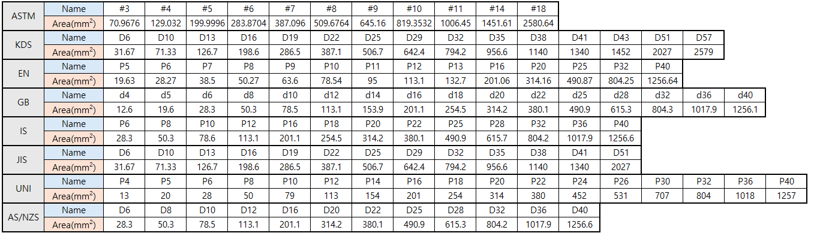

# Rebar Spacing Converter

**Intro**
------

This plugin allows you to check the spacing of rebars of various diameters based on the rebar area.

**Version**
------
__v1.0.0__: Plugin release

**Language**
------
__English__

**Benefits of this plugin**
------

In design practice, it's often necessary to consider changing the diameter of rebar to a different size.

When this happens, the spacing dictated by the existing rebar diameter must also change according to the new diameter, simplifying the redesign process if it is recalculated based on the rebar area.

- Quickly verify rebar spacing according to standards, enhancing design and construction efficiency.
- Supports a rebar database to check spacing according to standards.

**How to use this plugin?**
------
1. Select the **national rebar standard**.
2. Choose the **input method** from a radio list.
3. Select the **rebar size** and **spacing**.
4. Click the **Add to below list** button to add the selected rebar size and spacing to the list.

#### Rebar Spacing Verification:
- Rebars are placed according to the entered size and spacing.
- You can verify the spacing of rebars of various diameters while maintaining the same area.

Supported Rebar Standards
  **ASTM**: American Society for Testing Materials
  **KS** : Korean Industrial Standards 
  **EN**: European Code
  **GB**: Chinese National Standard
  **IS**: Indian Standards
  **JIS**: Japanese Industrial Standards
  **UNI**: Italian National Standards
  **AS/NZS**: Australian/New Zealand Standards

#### Input Methods
Examples are set as follows depending on the input method:

**Input Method 1**: Enter one rebar size
- Rebar Size Selection: e.g., #4
- Spacing Input: e.g., 100
- In this case, #4 rebars are positioned at 100 intervals.

**Input Method 2**: Enter two rebar sizes
- Rebar Size Selection: e.g., #4, #6
- Spacing Input: e.g., 100
- In this case, #4 and #6 rebars are alternately positioned at 100 intervals.

**Conclusion**
------

Utilize the Rebar Spacing Converter Plugin to convert rebars of various diameters and verify rebar spacing based on the same area standard.