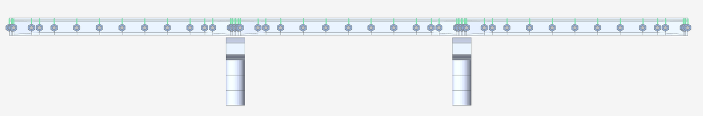
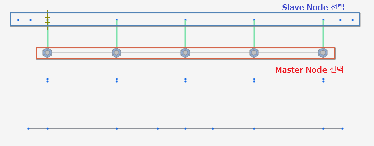
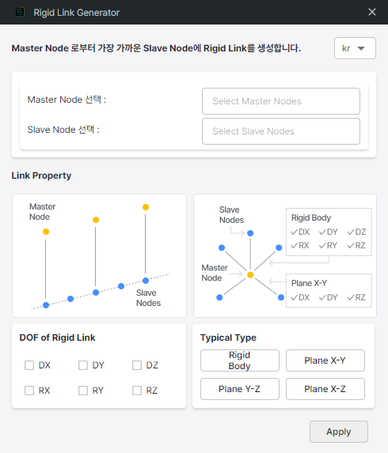

**Intro**
---------

본 플러그인은 Master Node 와 Slave Node를 그룹화하여 선택하며, Master Node로부터 가장 가까운 거리의 Slave Node로 Rigid Link 가 생성됩니다.

*   부등간격 Rigid Link를 생성할 때 Distance 값을 넣지 않아도 Rigid Link를 생성할 수 있습니다.
    
*   Master Node에 가장 가까운 Slave Node로 Rigid Link 가 생성됩니다.
    
*   상부 구조물에서 Girder 와 Slab를 Beam 요소와 Plate 요소로 생성하였을 경우, 강체 거동을 위한 Rigid Link의 생성 작업에 유용하게 활용할 수 있습니다.
    

**Version**
-----------

v 1.0.0 : 플러그인 배포

**Language**
------------

한국어, 영어

**Benefits of this plugin**
---------------------------

기존의 Rigid Link 입력 방식은, Master Node를 선택 한 후 연결 될 Slave Node를 정확히 선택합니다. 또한 부등간격의 Rigid Link를 생성하기 위해 ‘Copy Rigid Link’ 기능을 통해 정확한 간격을 입력해주어야 합니다.

본 플러그인은 Master Node들을 선택 한 후, Slave Node를 하나씩 선택하거나 부등간격을 입력하지 않아도 Rigid Link를 생성할 수 있습니다.

**How to use this plugin?**
---------------------------

 
[거더 -슬래브 Rigid Link 강체 연결]

 

 
[Node 선택 방법]

 

 
[입력창]

 

1.  **Master Node 선택**  
    Master Node 가 될 절점들을 선택합니다. midas Civil 에서 Node 를 선택 한 뒤, plug in 의 ‘Select Master Nodes’ 입력창을 클릭하면 해당 절점들이 입력됩니다. 위 예시에서는 거더를 구성하는 절점들을 선택합니다.  
    
2.  **Slave Node 선택**  
    Master Node 에 연결 될 Slave Node 들을 선택합니다. 위 예시에서는 슬래브 요소에 해당하는 절점들을 선택합니다.  
    
3.  **Link Property**  
    Rigid LInk 의 Property를 선택합니다. midas Civil UI와 동일합니다.  
    
4.  **Apply**  
    Apply Button 을 클릭하면 Master Node로부터 Slave Node 그룹 중 가장 가까운 Node로 Rigid Link 가 생성됩니다.
    

**Model File**
--------------

**Conclusion**
--------------

상부 구조물 모델링 과정 중, girder 를 beam 요소로, slab를 plate 요소로 모델링 할 시 유용하게 활용할 수 있습니다.

부등간격을 직접 입력하지 않아도 가장 가까운 절점으로 Rigid Link가 생성됩니다.

