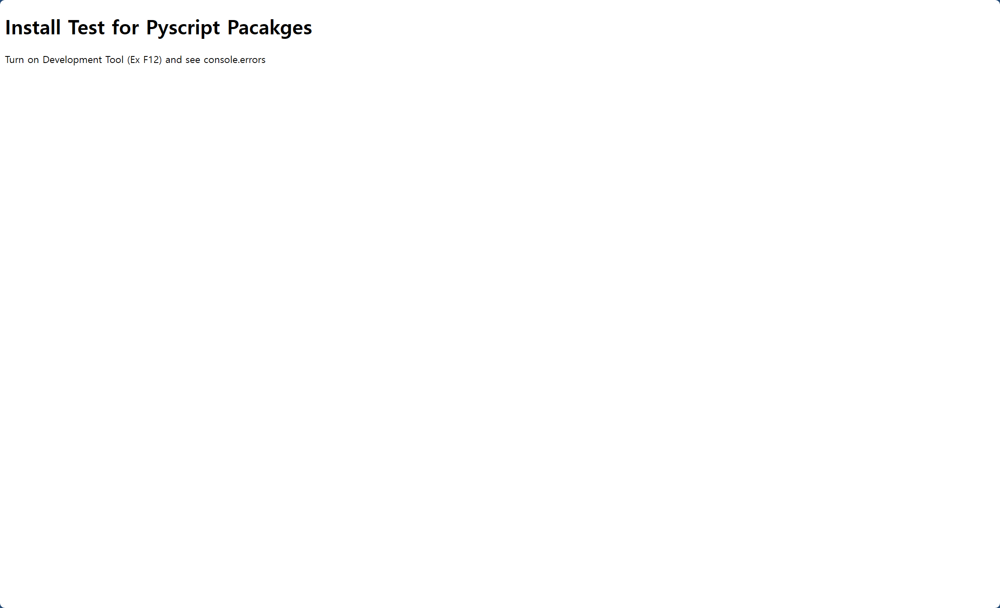
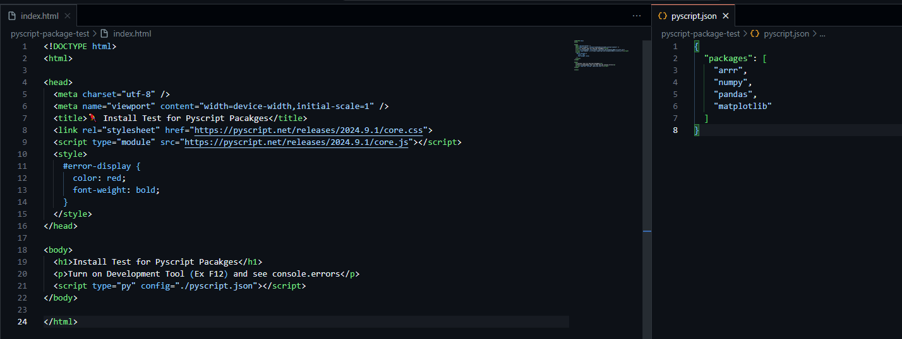
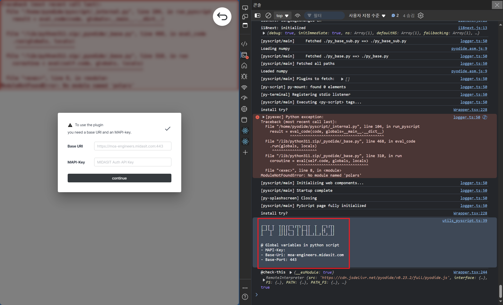
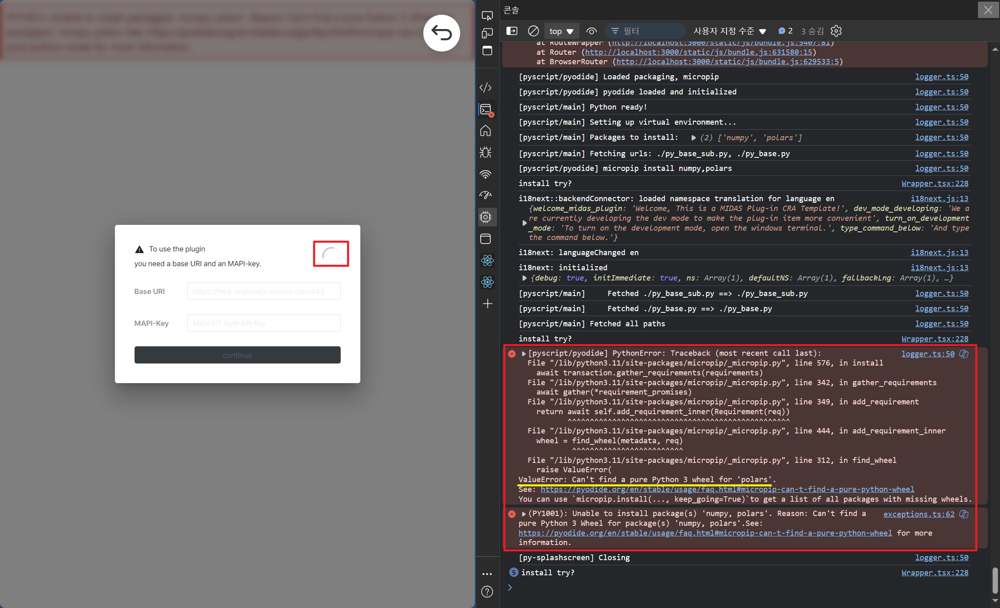
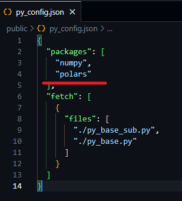

## **PyScript Package Compatibility Testing Page**

This page is designed to verify which packages are compatible with the **PyScript** environment. Since PyScript runs in a browser-based environment, it has certain restrictions compared to standard OS-level Python. This testing page allows you to check if a particular package works correctly within PyScript.

### PyScript Package Restrictions

When installing packages in PyScript, you need to be aware of the two primary restrictions mentioned in the [Pyodide documentation](https://pyodide.org/en/stable/usage/faq.html#why-can-t-micropip-find-a-pure-python-wheel-for-a-package):

- **The package is pure Python, but no wheel file is uploaded**  
  If the package is written purely in Python, but the maintainer has not uploaded a wheel file to PyPI, you might encounter issues. In this case, you can report the issue in the package’s issue tracker or build the wheel yourself, upload it temporarily, and install it via `micropip`.

- **The package contains binary extensions**  
  If the package contains binary extensions such as C, Fortran, or Rust, it needs to be packaged specifically for Pyodide. Check if an issue for this package already exists, and if not, create a new one.

When PyScript initializes, it downloads the associated Pyodide environment and checks these restrictions when trying to install a specified package. If no pure Python wheel is found, an error will occur during the installation process.

### How to Use the Test Page

Follow these steps to test if a package is compatible with PyScript:

1. **Run `index.html`**  
   Load the test page.

   

2. **Edit `pyscript.json`**  
   Add the package you want to test to the `pyscript.json` file and save the changes.

   

3. **Refresh `index.html` and open Developer Tools**  
   After refreshing the page, open the Developer Tools (F12) and check the **Console** for any errors during the package installation process.

   

4. **Verify Package Compatibility**  
   If no error messages appear in the Console, the package is compatible with PyScript.

 

## Resolving VerifyDialog Infinite Loading Issue

If the **VerifyDialog** of your plugin is stuck in an infinite loading state, it is likely due to **PyScript** not loading correctly. For **VerifyDialog** to load successfully, the web page must be fully loaded, and the JavaScript global variables `pyscript` and `pyscript.interpreter` must be available.

If these variables are not present, the system will attempt to check for their existence every 100ms until they are available.

### How to Check

Open **Developer Tools (F12)** in your browser and check the **Console** to see if PyScript has loaded correctly.

- **PyScript loaded successfully**

  

- **VerifyDialog stuck in infinite loading due to package load error**

  
  
